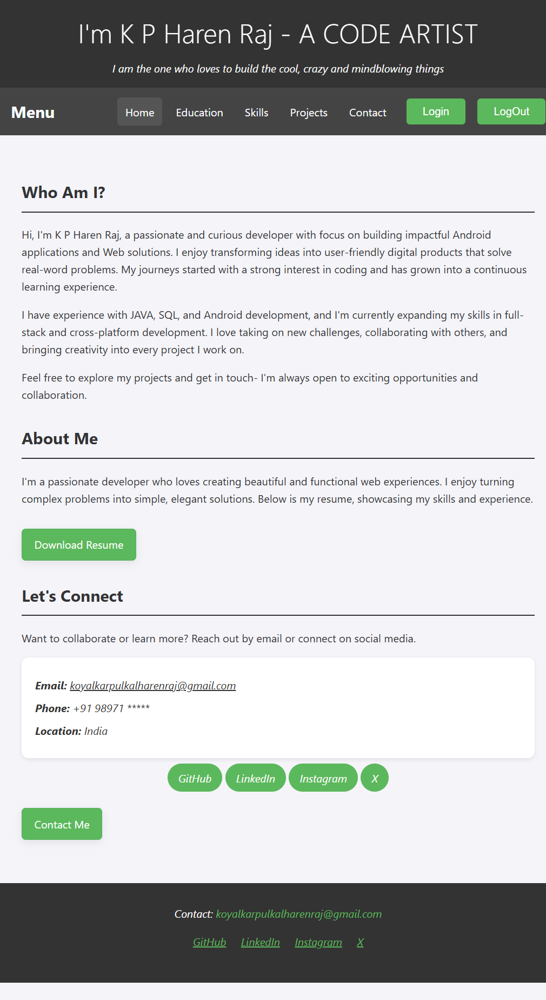
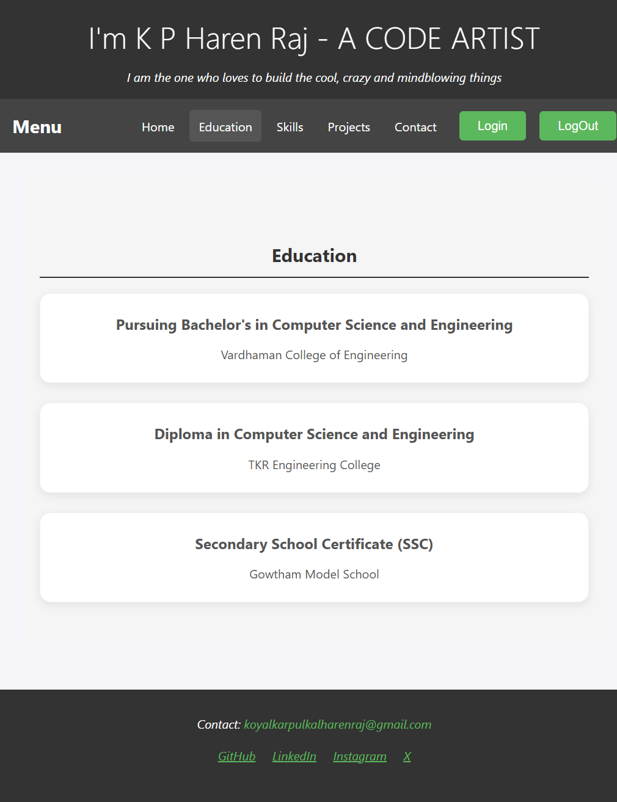
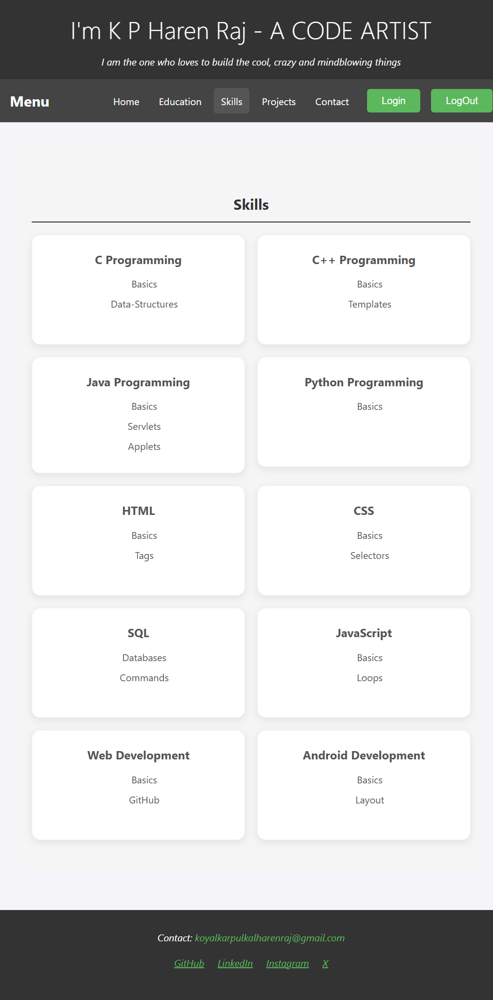
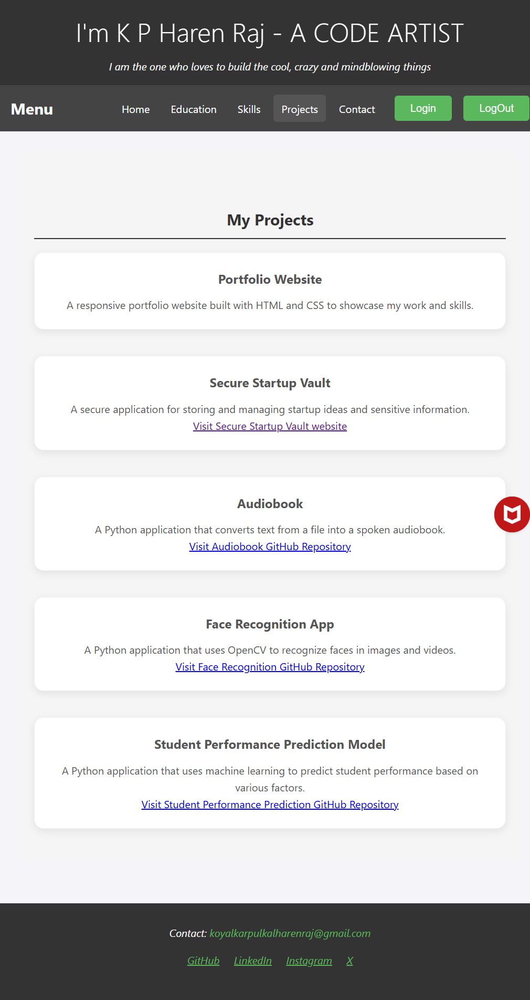
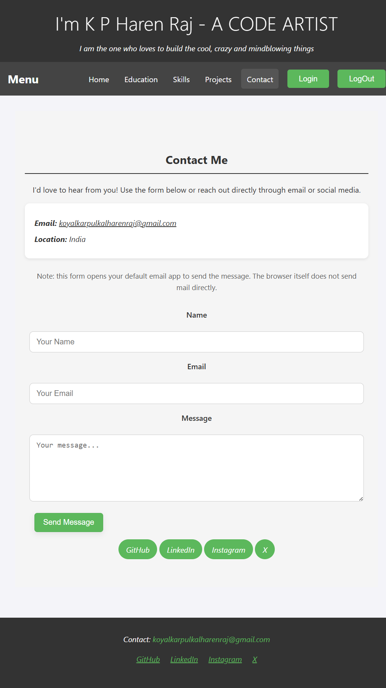

# HAREN_RAJ_PORTFOLIO

> A premium, modern personal portfolio website crafted to showcase education, technical skills, projects, and professional presence in a polished digital experience.

[](https://developer.mozilla.org/en-US/docs/Web/HTML)
[](https://developer.mozilla.org/en-US/docs/Web/CSS)
[](https://developer.mozilla.org/en-US/docs/Web/JavaScript)
[](https://pages.github.com/)
[](https://github.com/kpharenraj/HAREN_RAJ_PORTFOLIO)

## About Me
Hello! I’m Haren Raj, a passionate developer focused on building clean, functional, and visually appealing web experiences. This portfolio reflects my academic background, growing technical skills, and selected projects in a structured and professional way.

<div align="center">
    
    
</div>


## 1. Project Overview
This repository contains a personal portfolio website created to present my identity as a developer in a modern and accessible way. It serves as a digital resume and project gallery, making it easy for visitors to explore my background and interests at a glance.

## 2. Features
- Responsive and visually polished layout
- Dedicated sections for education, skills, projects, and contact
- Smooth navigation across multiple pages
- Structured content that highlights professional growth
- Mobile-friendly design for a better viewing experience
- Simple deployment through GitHub Pages

## 3. Tech Stack
- HTML5 for content structure
- CSS3 for styling and layout design
- JavaScript for lightweight interactivity
- GitHub Pages for hosting
- XAMPP for local development and testing

## 4. Folder Structure
```text
HAREN_RAJ_PORTFOLIO/
├── index.html
├── contact.html
├── education.html
├── projects.html
├── skills.html
├── style.css
├── education/
│   ├── btech.html
│   ├── diploma.html
│   └── secondary.html
├── projects/
│   ├── portfolio.html
│   └── secure-startup-vault.html
└── skills/
    ├── backend/
    │   └── fastapi.html
    ├── database/
    │   └── sql.html
    ├── programming/
    │   ├── c.html
    │   ├── cpp.html
    │   ├── java.html
    │   └── python.html
    ├── tools/
    │   ├── git.html
    │   └── github.html
    └── web/
        ├── css.html
        ├── html.html
        └── javascript.html
```

## 5. How to Use
1. Clone the repository:
   ```bash
   git clone https://github.com/kpharenraj/HAREN_RAJ_PORTFOLIO.git
   ```
2. Open the project folder in your preferred editor.
3. Launch the website locally using XAMPP or by opening the HTML files in a browser.
4. For online deployment, publish the project through GitHub Pages.

## 6. Screenshots
<div align="center">
    
    
    
    
    
</div>

## 7. Live Demo Link
- Live Site: https://kpharenraj.github.io/HAREN_RAJ_PORTFOLIO/

## 8. Future Plans
- Introduce dark mode
- Add interactive animations and transitions
- Expand the projects section with more detailed showcases
- Improve accessibility and visual consistency
- Add a blog or testimonials section for a more dynamic portfolio

## 9. License
This project is currently unlicensed. If you plan to share it more broadly, you may add an MIT license or another suitable open-source license.
